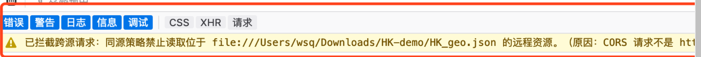
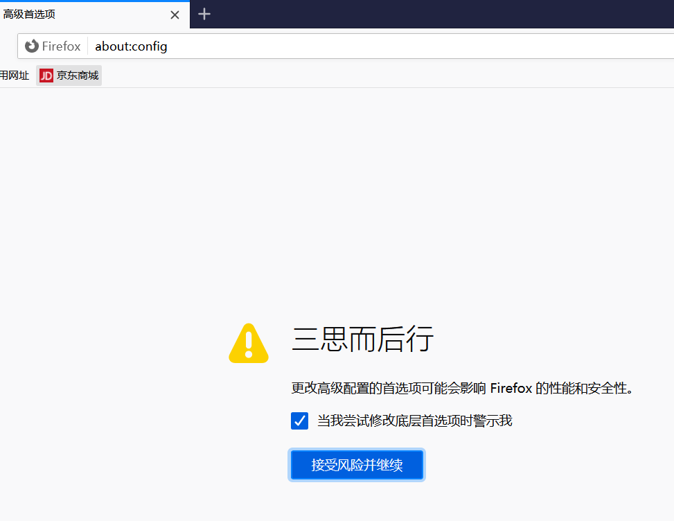
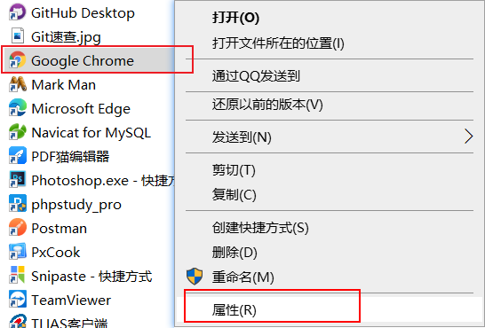
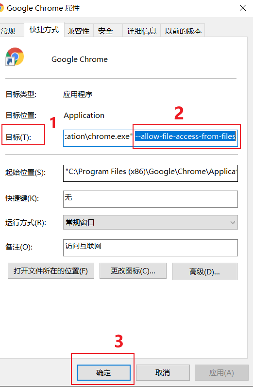

## 解决浏览器无法访问本地文件的问题

### 推荐下载安装火狐或谷歌浏览器

### 如何解决浏览器无法访问本地文件的问题

#### ① 火狐浏览器

详情见网页: <https://blog.csdn.net/qq_28867949/article/details/99890103>

1. `Ctrl + T` 打开新窗口;

2. 输入 `about:config` 回车 进入高级设置（点击接受风险并继续）
    

3. 搜索 `security.fileuri.strict_origin_policy`，并设置该项为 `false`
    

4. 最后重启浏览器

#### ② 谷歌浏览器

详情见网页: <https://blog.csdn.net/weixin_40194150/article/details/89458065?utm_medium=distribute.pc_relevant.none-task-blog-2%7Edefault%7EBlogCommendFromMachineLearnPai2%7Edefault-1.baidujs&dist_request_id=&depth_1-utm_source=distribute.pc_relevant.none-task-blog-2%7Edefault%7EBlogCommendFromMachineLearnPai2%7Edefault-1.baidujs>

1. 右击浏览器图标点击 **“属性”**
    

2. 找到 **“目标”** 属性, 在最后面添加: `--allow-file-access-from-files`
    

3. 重启浏览器
